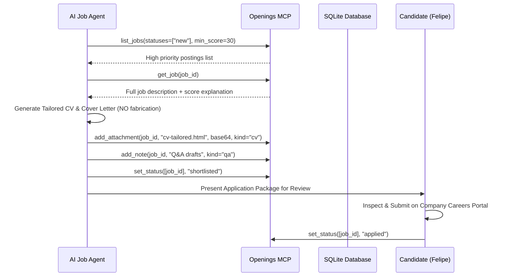

# MCP Tool Inventory — Openings OS

**Endpoint:** `http://127.0.0.1:8501/mcp` (Streamable HTTP)
**Authentication:** Optional `Authorization: Bearer <token>` or `X-Openings-Token: <token>`

---

## 1. Read Tools

| Tool | Purpose | Inputs | Outputs | Risk Level | Tested |
|------|---------|--------|---------|------------|--------|
| `list_jobs` | Search & summarize jobs | `statuses`, `sources`, `labels`, `job_types`, `locations`, `min_score`, `sort`, `limit`, `offset` | Summary list with metrics | LOW | YES |
| `get_job` | Fetch full posting details | `job_id`, `include_raw` (bool), `max_description_chars` | Full posting, `explain`, notes, attachments | LOW | YES |
| `search_similar` | Find semantic neighbours | `query` / `job_id`, `n_results`, `min_score`, `source`, `statuses` | Similar job list with scores | LOW | YES |
| `get_statistics` | Fetch database metrics | None | Total jobs, by status, seen today, avg score, counts | LOW | YES |
| `get_score_distribution` | Score histogram | None | `[bin_start, count]` pairs | LOW | YES |
| `get_facets` | Distinct field values | `limit`, `q` | Facet counts (sources, locations, companies) | LOW | YES |
| `list_labels` | List tags | None | Tag list with usage count | LOW | YES |
| `list_blacklist` | List hidden jobs | Pagination | Blacklisted jobs with text, company | LOW | YES |
| `list_sources` | Active scrapers status | None | Source list, active count, last run | LOW | YES |
| `list_runs` | Collection run history | None | Recent runs, per-source counts, errors | LOW | YES |
| `list_attachments` | Query attachments | `kind`, `statuses` | Attachment metadata across jobs | LOW | YES |
| `get_attachment` | Download file | `attachment_id` | Base64 encoded payload (max 5 MB) + meta | LOW | YES |
| `get_settings` | Read live config | None | Summary of current settings | LOW | YES |
| `get_settings_reference` | Read config docs | None | Annotated settings reference | LOW | YES |

---

## 2. Write Tools (Controlled & HITL Scoped)

| Tool | Purpose | Inputs | Outputs / Effect | Risk Level | HITL Boundary |
|------|---------|--------|------------------|------------|---------------|
| `add_job` | Ingest new posting | Digested fields, `job_url`, `status` | Job created/updated, live scored | LOW | Auto-safe |
| `update_job` | Edit posting fields | `job_id`, fields | Posting updated & rescored | LOW | Auto-safe |
| `set_status` | Advance pipeline | `job_ids`, `status`, `note` | Status updated on timeline | **MEDIUM** | **HITL Required for `applied`** |
| `add_labels` / `remove_labels` | Tag management | `job_ids`, `labels` | Labels attached/detached | LOW | Auto-safe |
| `add_note` / `update_note` | Store Q&A / research | `job_id`, `kind` (`note`/`qa`), `title`, `body` | Note attached to job timeline | LOW | Auto-safe |
| `add_attachment` | Store tailored CV/Cover | `job_id`, `filename`, base64, `kind` (`cv`/`cover_letter`/`form_answers`) | Attachment persisted | LOW | Auto-safe |
| `update_attachment` / `delete_attachment` | Manage files | `attachment_id`, fields | Attachment modified/deleted | LOW | Auto-safe |
| `blacklist_jobs` / `unblacklist_jobs` | Hide noise | `job_ids` | Job blacklisted & hidden | LOW | Auto-safe |
| `merge_jobs` | Deduplicate | `primary_id`, `other_ids` | Duplicate folded into primary | LOW | Auto-safe |
| `delete_jobs` | Remove postings | `job_ids` | Permanently deleted | HIGH | User explicit |
| `run_now` | Trigger intake | None | Collection run initiated | LOW | Auto-safe |
| `export_jobs` | Export dataset | Filters, format (`csv`/`json`) | Export file generated | LOW | Auto-safe |

---

## 3. Candidate Agent Workflow Integration

