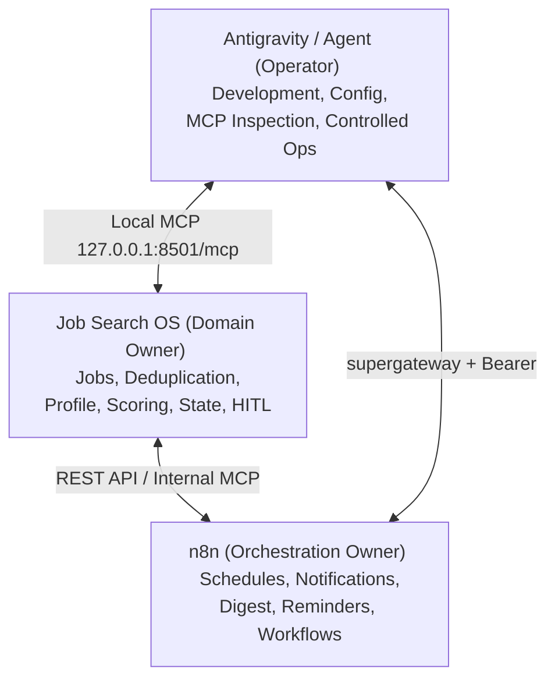

# n8n VM Integration Architecture — Phase 2 Spec

## 1. Operational State of n8n MCP Server
- **Current Operational Endpoint:** `https://n8n.avaliasolar.com.br/mcp-server/http`
- **Transport:** JSON-RPC SSE / Streamable HTTP (`text/event-stream`).
- **Bridge Tooling:** `supergateway` connects local agent stdio directly to the live n8n MCP endpoint.
- **Rule:** The existing n8n MCP server, JWT authentication tokens, and NPM configuration are ALREADY OPERATIONAL and must NOT be altered or duplicated.

## 2. Systems Responsibilities Boundary

## 3. Communication Strategy for VM Deployment
- **Private Network Option:** When `job-search` is deployed on VM `64.225.59.107`, n8n communicates with Job Search OS via private Docker network (`job-search-internal`) or host gateway (`127.0.0.1:8501`).
- **No Public Exposure:** Job Search OS `/mcp` and `/api` endpoints remain private to localhost.
