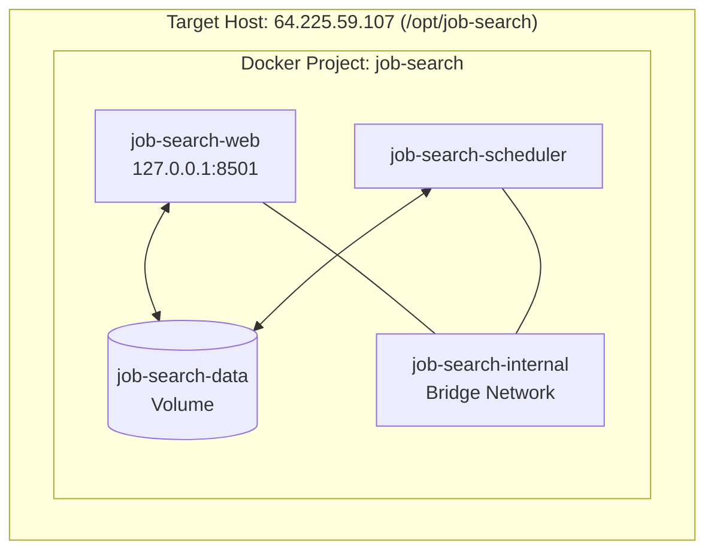

# Production Architecture — Personal Job Search OS

## 1. Container Topology

## 2. Structural Guarantees
- **Web Service:** `job-search-web` exposes REST API and MCP endpoint locally on `127.0.0.1:8501`.
- **Scheduler Service:** `job-search-scheduler` runs single-instance intake and rescoring loop at configured 12h interval.
- **Persistence Layer:** SQLite database and generated attachments stored in named volume `job-search-data` mounted at `/data`.
